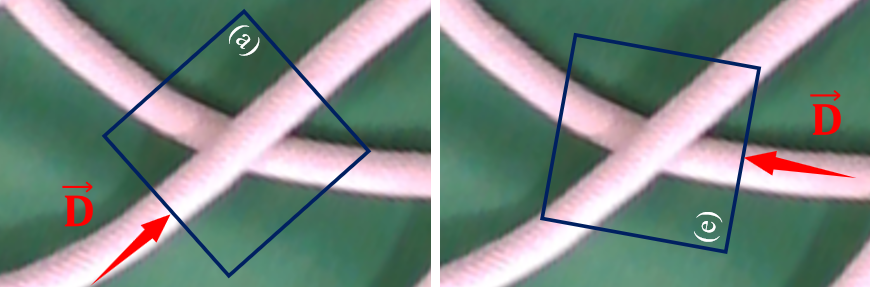
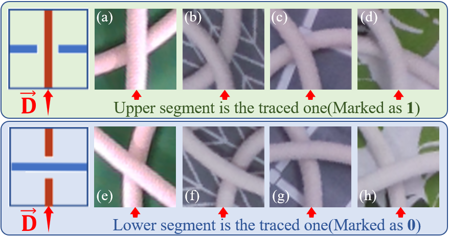

# DLOs Segmentation & Crossings Classification(DLOsSCC)

## Dataset for DLOs segementation | [DLOsS](https://drive.google.com/drive/folders/1Y7g3vsS8e2MvCvQczXEkQI6sUg8tD0Ok?usp=sharing)
Dataset DLOsS aims to be used in single-DLO or multi-DLOs segmentation tasks. 

As shown in the first collum of the following figure, DLO(s) were placed on four different backgrounds with some distracting objects. The second collum shows the DLO contours. The overlap parts in the crossing areas are marked as blue circles here. The third collum further indicates the gradient map of the contours. In the gradient map, the DLO segments are depicted by colors of varying shades from one endpoint of the DLO to the other. 

### Information
- Image size: 960x540(pixels);
- File format: .bmp(zip/rar);
- Dataset scales: 2000 single DLO + 1500 multi DLOs;
- [Download](https://drive.google.com/drive/folders/1Y7g3vsS8e2MvCvQczXEkQI6sUg8tD0Ok?usp=sharing)

## Dataset for DLOs crossings classification | [DLOsCC](https://drive.google.com/drive/folders/1vY-Z_7Dg98PyUO8UzyBso9N5jDXJDqa9?usp=sharing)
Dataset DLOsCC aims to be used in the DLO crossings classification tasks. Only crossings consisting of two DLO segments at one point are considered here. 

As shown in the following figure, Arrow 'D' denotes the direction in which the segment is traced. Crossings were cropped by a square boundary, the rotation angle of which depends on the direction of arrow 'D'. 'D' always appears at the midpoint of the bottom boundary. 

After rotation, the direction 'D' in the cropped crossing region is upwards. The DLO segment entered from the midpoint of the bottom boundary is regarded as the target DLO segment. Examples here in the above figure map to (a) and (e) below:

Cropped crossing regions were classified into two categories: UPPER and LOWER. The category represents the anteroposterior position of the two segments in the crossing. Four different backgrounds were used during data collection. 

### Information
- Image size: 50x50(pixels);
- File format: .png(zip);
- Dataset scales: 1883 UPPER images + 1883 LOWER images;
- [Download](https://drive.google.com/drive/folders/1vY-Z_7Dg98PyUO8UzyBso9N5jDXJDqa9?usp=sharing)